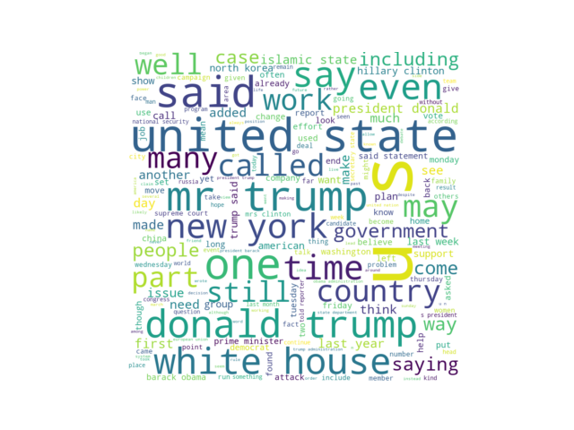
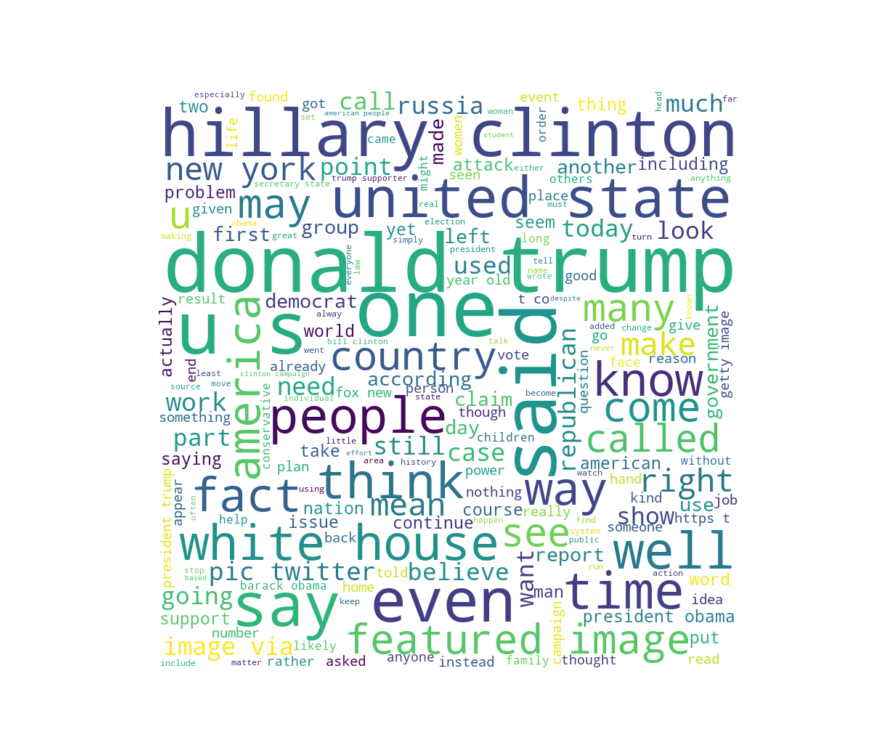

# Data Analysis Hackathon Project
This project was created for the CANIS Data Analysis Hackathon. The task was to create compelling data visualizations that would help others understand the survey results in a meaningful way. The dataset used in this project is available on Kaggle through this link.

## Project Purpose
The purpose of this project is to analyze the dataset and create data visualizations that help to illustrate the findings in an understandable and meaningful way.

## Project Overview
The project involves data analysis of the misinformation fake news text dataset. The project includes the following steps:

## Load the data into a pandas dataframe
Preprocess the text by removing stopwords and punctuation
Perform sentiment analysis on the text
Conduct named entity recognition on the text
Generate word cloud of the text

##Code
The code for this project is written in Python and requires the following dependencies:

- pandas
- nltk
- textblob
- matplotlib
- wordcloud
Please refer to the above code for the full implementation.

## Results
The results of this project include data visualizations that can be used to understand the findings of the dataset. The project includes word clouds generated from the preprocessed text, which show the most frequent words in the text.

### True Cloud:

### Fake Cloud:

## Conclusion
In conclusion, this project provides valuable insights into the dataset and helps to illustrate the findings in an understandable way.
