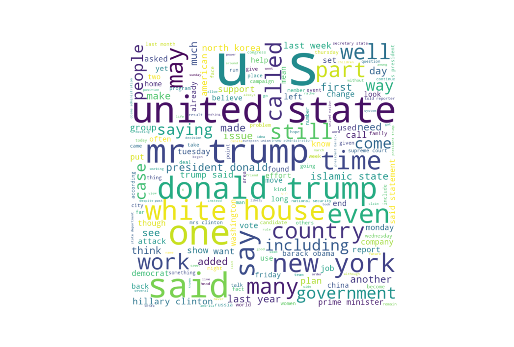
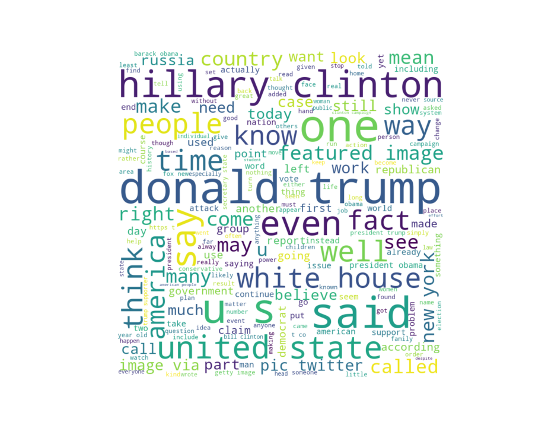

# Data Analysis Hackathon Project 👩‍💻
This project was created for the CANIS Data Analysis Hackathon. The task was to create compelling data visualizations that would help others understand the survey results in a meaningful way. The dataset used in this project is available on Kaggle through this [link](https://www.kaggle.com/datasets/stevenpeutz/misinformation-fake-news-text-dataset-79k?resource=download)

## Project Purpose ⛳
The purpose of this project is to analyze the dataset and create data visualizations that help to illustrate the findings in an understandable and meaningful way.

## Project Overview 👓
The project involves data analysis of the misinformation fake news text dataset. The project includes the following steps:

## Contributors 🙌
- **Dayee Lee** | ```Team Lead, Python developer, Data visualization```
  - Developed a Python script to create a word cloud from the data
  - Organize data into an Excel file with numeric values.
  - Coordinate the team's efforts!


- **Ayoung Lee** ```Data analyst (R)```
  - Used R to analyze the data in more depth, looking for patterns, correlations, and other insights. 
  - Collaborated with other team members to identify interesting findings.


- **Daeun Lee** ```Data analyst (R), Presentor```
  - Used R to analyze the data in more depth, looking for patterns, correlations, and other insights. 
  - Collaborated with other team members to identify interesting findings.
  - Compiled and synthesized findings into a report and delivered to presentations to stakeholders.


- **Youngbin Kim** ```Data analyst (R)```
  - Used R to analyze the data in more depth, looking for patterns, correlations, and other insights. 
  - Collaborated with other team members to identify interesting findings.


##Dependencies 📦
The code for this project is written in Python and requires the following dependencies:

- pandas
- nltk
- textblob
- matplotlib
- wordcloud

To install the dependencies, run the following commands:
```commandline
pip install pandas
pip install nltk
pip install textblob
pip install matplotlib
```

## Implementation 🛠️

The implementation consists of the following steps:

1. Load the data into a pandas dataframe.
2. Preprocess the text by removing stopwords and punctuation.
3. Perform sentiment analysis on the text.
4. Conduct named entity recognition on the text.
5. Generate a word cloud of the text.

Please refer to the code below for the full implementation.

## Results 📊
The results of this project include data visualizations that can be used to understand the findings of the dataset. The project includes word clouds generated from the preprocessed text, which show the most frequent words in the text.

### True Cloud:


### Fake Cloud:


## Conclusion 👉🏼✅
In conclusion, this project provides valuable insights into the dataset and helps to illustrate the findings in an understandable way.
